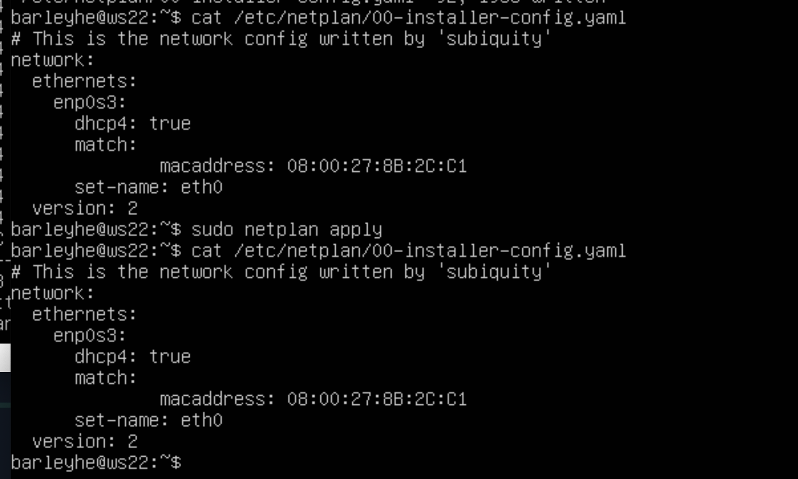
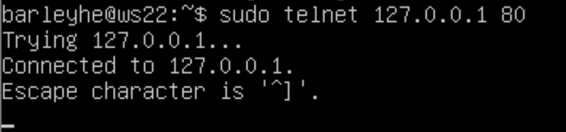

# Сети в Linux

## Part 1. Инструмент ipcalc

- Запускаем виртуальную машину. Если надо переименовываем ее:
    - проверяем название машины sudo hostnamectl;
    - меняем название машины:
    
    - перезагружаем машину: reboot.
    
### 1.1. Сети и маски
- устанавливаем утилиту ipcalc:
    
    
- Адрес сети 192.167.38.54/13
    
    
- Перевод маски 255.255.255.0:
     - префиксная: /24;
     - двоичная запись: 11111111.11111111.11111111. 00000000;
     - /15 ipcalc /15:
        - обычная: 255.254.0.0;
        - двоичная: 11111111.11111110.00000000. 00000000
    - 11111111.11111111.11111111.11110000:
        - обычная: 255.255.255.240;
        - префиксная: /28.

- Минимальный и максимальный хост в сети 12.167.38.4 при масках:
    - /8:
        
    - 11111111.11111111.00000000.00000000:
        
    - 255.255.254.0:
        
    - /4:
        

### 1.2. localhost
-  можно ли обратиться к приложению, работающему на localhost, со следующими IP: 194.34.23.100 - нельзя,  
    127.0.0.2 - можно,  
    127.1.0.1 - можно,  
    128.0.0.1 - нельзя,  
потому что localhost (так называемый, «местный» от англ. local, или «локальный
хост», по смыслу — этот компьютер) — в компьютерных сетях, стандартное,
официально зарезервированное доменное имя для частных IP-адресов (в диапазоне
127.0.0.1 — 127.255.255.254, RFC 2606). Для сети, состоящей только из одного
компьютера, как правило, используется всего один адрес — 127.0.0.1.  

### 1.3. Диапазоны и сегменты сетей

- Частный IP-адрес[1][2] (англ. private IP address), также называемый внутренним,
 внутрисетевым или локальным — IP-адрес, принадлежащий к специальному диапазону, не используемому в сети Интернет. Такие адреса предназначены для применения в
 локальных сетях, распределение таких адресов никем не контролируется. В связи с
 дефицитом свободных IP-адресов провайдеры всё чаще раздают своим абонентам
 именно внутрисетевые адреса, а не внешние, при этом они все выходят в интернет
 через один внешний IP (так называемый «белый IP»).
    Иногда частные адреса называют неанонсированными, внешние (так называемые «белые IP») — анонсированными.
    Следующие диапазоны определены IANA как адреса, выделенные локальным сетям:
     - 10.0.0.0 — 10.255.255.255 (маска подсети для бесклассовой (CIDR) адресации: 255.0.0.0 или /8);
    - 100.64.0.0 — 100.127.255.255 (маска подсети 255.192.0.0 или /10). Данная подсеть рекомендована согласно RFC 6598 для использования в качестве адресов для CGN (Carrier-Grade NAT);
    - 172.16.0.0 — 172.31.255.255 (маска подсети: 255.240.0.0 или /12);
    - 192.168.0.0 — 192.168.255.255 (маска подсети: 255.255.0.0 или /16).
      
    Какие из перечисленных IP можно использовать в качестве публичного, а какие
        только в качестве частных:
    - 10.0.0.45 - частные,  
    - 134.43.0.2 - публичные,   
    - 192.168.4.2 - частные,   
    - 172.20.250.4 - частные,   
    - 172.0.2.1 - публичные,   
    - 192.172.0.1 - публичные,  
    - 172.68.0.2 - публичные,   
    - 172.16.255.255 - частные,   
    - 10.10.10.10 - частные,   
    - 192.169.168.1 - публичные.  
    
- Какие из перечисленных IP адресов шлюза возможны у сети 10.10.0.0/18:
    - 10.0.0.1 - не возможен, 
    - 10.10.0.2 - возможен, 
    - 10.10.10.10 - возможен, 
    - 10.10.100.1 - не возможен, 
    - 10.10.1.255 - возможен.  
диапазон вхождения - 10.10.0.1 до 10.10.63.254

## Part 2. Статическая маршрутизация между двумя машинами

- создаем вторую виртуальную машину (ws2) с помощью кнопки NEW или клонируем существующий (ws1).
- Команда ip a для просмотра существующих интерфейсов:
    - для ws2:
    
    - для ws1:
    
    
- ws1 задать адрес и маску 192.168.100.10, /16
    
- ws2 задать адрес и маску  172.24.116.8, /12.
    
- Выполни команду netplan apply для перезапуска сервиса сети:
    - ws1: 
    
    - ws2:  
    

### 2.1. Добавление статического маршрута вручную

- статический маршрут от одной машины до другой и обратно при помощи команды вида sudo ip r add 172.24.116.8 via  192.168.100.10 и пингуем соединения:
    - ws1: 
        
    - ws2: 
        

### 2.2. Добавление статического маршрута с сохранением

- reboot - перезапуск машин.
- Добавление статистического маршрута с одной машины до другой с помощью файла etc/netplan/00-installer-config.yaml:
    - ws1:
    
    - ws2:
    
- Проринговка соединений между машинами:
    - ws1:
    
    - ws2:
    

## Part 3. Утилита iperf3

### 3.1. Скорость соединения
- перевести:
    - 8 Mbps - 1 MB/s;
    - 100 MB/s - 100000 Kbps;
    - 1 Gbps - 1000 Mbps;

### 3.2. Утилита iperf3
- Добавляем новый адрес:
    - ws1:
    
    - ws2:
    
    
- Измеряем скорость соединения между ws1 и ws2: 
    - ws1:
        
    - ws2:
        

## Part 4. Сетевой экран

### 4.1. Утилита iptables
- ws1:
    
- ws2:
    

- Запускаем файлы на обеих машинах командами chmod +x /etc/firewall.sh и /etc/firewall.sh:
    - ws1:
        
    - ws2:
          
Первая машина отправляет запрос, получает ответ. Вторая машина отправляет запрос, не получает ответ. Работает первое правило, второе игнорируется.

### 4.2. Утилита nmap
-   Установить nmap, если не установлено: sudo apt install nmap
- находим машину, которая не "пингуется":
    - ws1:
        
    - ws2:
        
- применяем утилиту nmap:
    
- Сохраняем дампы образов виртуальных машин:
    - ws1:
        
    - ws2:
        
        
        
## Part 5. Статическая маршрутизация сети

- Подняли пять виртуальных машин (3 рабочие станции (ws11, ws21, ws22) и 2 роутера (r1, r2)):
            

### 5.1. Настройка адресов машин
- PC-ws11:
    
- PC-ws21:
    
- PC-ws22:
    
- r1:
    
- r2:
    

- Проверяем командой ip -4 a:
    - PC-ws11:
        
    - PC-ws21:
        
    - PC-ws22:
        
    - r1:
        
    - r2:
        

- Пинговка:
    - ws22 -> ws21:
        
    - r1 -> ws11:
        
        
### 5.2. Включение переадресации IP-адресов
- Для включения переадресации IP, выполнили команду на роутерах:
    - r1:
        
    - r2:
        

- Открой файл /etc/sysctl.conf и добавь в него следующую строку:
    - r1:
        
    - r2:
        

### 5.3. Установка маршрута по-умолчанию
- Настройка маршрут по-умолчанию (шлюз) для рабочих станций. Для этого добавь default перед IP роутера в файле конфигураций:
    - ws11:
        
    - ws21:
        
    - ws22:
        

-Вызываем ip r и показываем, что добавился маршрут в таблицу маршрутизации:
    - ws11:
        
    - ws21:
        
    - ws22:
        

- Пропингуй с ws11 роутер r2 и покажи на r2, что пинг доходит. Для этого используй команду tcpdump -tn -i eth0, для этого устанавливаем связь между роутерами:
     

    теперь пингуем ws11 и r2  
     
     

### 5.4. Добавление статических маршрутов
- Добавим в роутеры r1 и r2 статические маршруты в файле конфигураций:
    - r1:
         
    - r2:
         

- Вызываем ip r и показываем таблицы с маршрутами на обоих роутерах:
    - r1:
         
    - r2:
         
    
- Запускаем команды на ws11:
    - ip r list 10.10.0.0/[маска сети]:
         
    - ip r list 0.0.0.0/0:
         

IP-адрес 0.0.0.0 — это немаршрутизируемый адрес IPv4, который можно использовать в разных целях, в основном, в качестве адреса по умолчанию или адреса-заполнителя. Несмотря на то, что адрес 0.0.0.0 может использоваться в компьютерных сетях, он не является адресом какого-либо устройства. Говоря попросту, IP-адрес 0.0.0.0 означает «эта сеть», но для использования в традиционном смысле этот адрес непригоден. Это похоже на ссылку: «Вставьте сюда адрес», или, в зависимости от контекста, «без конкретного адреса назначения»
Для сети 10.10.0.0 мы создали правило, соответственно используется созданный маршрут.

### 5.5. Построение списка маршрутизаторов
- Запускаем на r1 команду дампа tcpdump -tnv -i eth0:
     
- При помощи утилиты traceroute построй список маршрутизаторов на пути от ws11 до ws21:
     

Утилита отслеживает, на какие узлы попадает сетевой пакет в процессе его передачи на целевой хост. По умолчанию используется UDP
 протокол – формируется UDP датаграмма, которая упаковывается в IP пакет. В одном из заголовков этого пакета утилита устанавливает значение параметра TTL (Time To Live) равным 1. Этот параметр используется для ограничения количества переходов от одного маршрутизатора к другому, т.е. позволяет избежать бесконечной передачи пакета между маршрутизаторами (например, в случае некорректно настроенного протокола динамической маршрутизации, или при ошибках в статических маршрутах). Каждый маршрутизатор, получив пакет, уменьшает значение TTL на 1 перед отправкой далее в сеть. В ситуации, когда после очередного уменьшения TTL становится равным 0 пакет считается недоставленным и отбрасывается, при этом маршрутизатор отвечает отправителю сообщением об ошибке.

При TTL = 1 traceroute, получая ответ от первого маршрутизатора, определяет его IP адрес и время, затраченное на обработку пакета. После этого TTL увеличивается на единицу для определения следующего маршрутизатора, и так далее до момента попадания пакета на целевой хост.

Как видим, утилита устанила значение параметра 1 (TTL), и отправила его. Получив ответ от отпрвителя, если нет ошибки, он увеличил TTL и отравил дальше, по адресу. В конечном итоге, мы видим всю цепочку следования, адреса, время.

### 5.6. Использование протокола ICMP при маршрутизации
- Запустим на r1 перехват сетевого трафика, проходящего через eth0 с помощью команды tcpdump -n -i eth0 icmp:  
      
      

- Пропингуй с ws11 несуществующий IP (например, 10.30.0.111) с помощью команды ping -c 1 10.30.0.111:
    

- Сохраняем дампы образов виртуальных машин:
    - ws11:
        
    - ws21:
        
    - ws22:
        

## Part 6. Динамическая настройка IP с помощью DHCP
- Для r2 настрой в файле /etc/dhcp/dhcpd.conf конфигурацию службы DHCP:
    - Укажем адрес маршрутизатора по-умолчанию, DNS-сервер и адрес внутренней сети:
        
    - В файле resolv.conf пропишем nameserver 8.8.8.8:
        
    - Перезагрузим службу DHCP командой systemctl restart isc-dhcp-server:
        
    -  Машину ws21 перезагрузим при помощи reboot и через ip a покажем, что она получила адрес: 
        
        
    - Также пропингуем ws22 с ws21:
        
        
    - Укажи MAC адрес у ws11, для этого в etc/netplan/00-installer-config.yaml надо добавить строки: macaddress: 10:10:10:10:10:BA, dhcp4: true:
        
        

- Для r1 настрой в файле /etc/dhcp/dhcpd.conf конфигурацию службы DHCP:
    - Укажем адрес маршрутизатора по-умолчанию, DNS-сервер и адрес с жесткой привязкой к MAC-адресу:
        
    - В файле resolv.conf пропишем nameserver 8.8.8.8:
        
    - Перезагрузим службу DHCP командой systemctl restart isc-dhcp-server:
        
    -  Машину ws11 перезагрузим при помощи reboot и через ip a покажем, что она получила адрес: 
        
    - Также пропингуем ws22 с r1:
        

- Запросим с ws21 обновление ip адреса:
    
Новая утилита dhclient служит для управления адресом интерфейса по протоколу DHCP. Опция -r освобождает текущий адрес.

- Сохраняем дампы образов виртуальных машин:
    - ws11:
        
    - ws21:
        
    - ws22:
        

## Part 7. NAT

- В файле /etc/apache2/ports.conf на ws22 и r1 изменим строку Listen 80 на Listen 0.0.0.0:80, то есть сделаем сервер Apache2 общедоступным:
    - ws22:
        
    - r1:
        

- Запустим веб-сервер Apache командой service apache2 start на ws22 и r1:
    - ws22:
        
    - r1:
        

- Добавляем в фаервол на r2 следующие правила:
    - Удаляем правила в таблице filter - iptables -F:
    - Удаляем правила в таблице "NAT" - iptables -F -t nat:
    - Отбрасываем все маршрутизируемые пакеты - iptables --policy FORWARD DROP:
        
    - Запускаем:
        

- Проверяем соединение между ws22 и r1 командой ping (не должна пинговаться): 
    

- Разрешить маршрутизацию всех пакетов протокола ICMP:
        
    - Запускаем (должна пинговаться):
        

- Включи SNAT, а именно маскирование всех локальных ip из локальной сети, находящейся за r2 (по обозначениям из Части 5 - сеть 10.20.0.0):
- Включи DNAT на 8080 порт машины r2 и добавить к веб-серверу Apache, запущенному на ws22, доступ извне сети:
    
    - Запускаем:
        

- Проверь соединение по TCP командой telnet [адрес] [порт]:
    - для SNAT: для этого с ws22 подключиться к серверу Apache на r1:
        
    - для DNAT: для этого с r1 подключиться к серверу Apache на ws22 командой telnet (обращаться по адресу r2 и порту 8080):   
        

## Part 8. Дополнительно. Знакомство с SSH Tunnels
- Запускаем на r2 фаервол с правилами из Части 7:
    
- Запусти веб-сервер Apache на ws22 только на localhost (то есть в файле /etc/apache2/ports.conf измени строку Listen 80 на Listen localhost:80):
    
- Воспользуйся Local TCP forwarding с ws21 до ws22, чтобы получить доступ к веб-серверу на ws22 с ws21 (ssh -L 5555:localhost:80 10.20.0.20):
    
    - Для проверки, сработало ли подключение в обоих предыдущих пунктах, перейди во второй терминал (например, клавишами Alt + F2) и выполни команду telnet 127.0.0.1 [локальный порт]:
    
- Воспользуйся Remote TCP forwarding c ws11 до ws22, чтобы получить доступ к веб-серверу на ws22 с ws11 (ssh -R 5555:10.20.0.20:80 barleyhe@localhost):
    
    - Для проверки, сработало ли подключение в обоих предыдущих пунктах, перейди во второй терминал (например, клавишами Alt + F2) и выполни команду telnet 127.0.0.1 [локальный порт]:
    